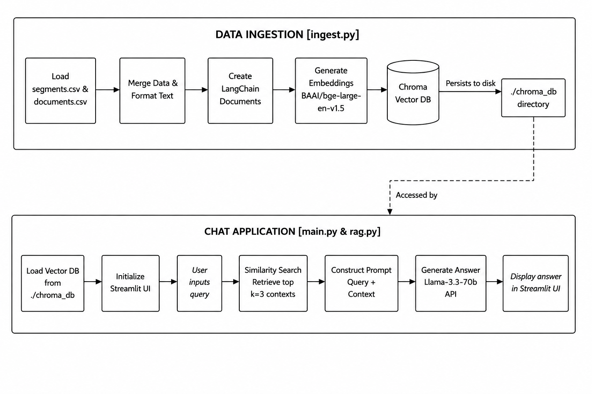
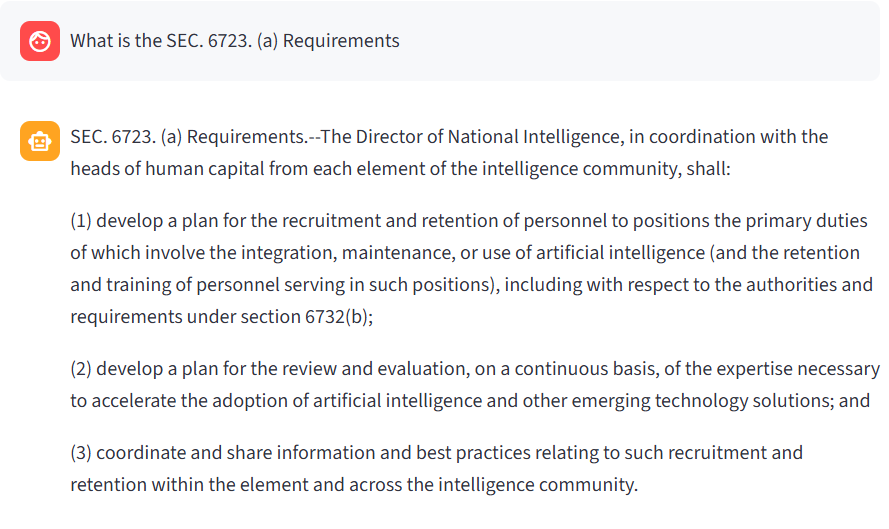
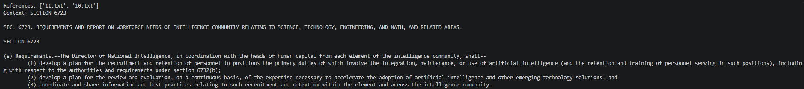
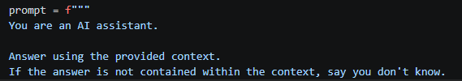

#  RAG Chatbot

This project is a Retrieval-Augmented Generation (RAG) chatbot application. It ingests text documents, builds a local vector database using Chroma, and provides a Streamlit interface. The bot leverages Hugging Face embeddings for document retrieval and Nvidia's API (using Llama 3.3) for generating answers.

---

## Project Structure

- **`ingest.py`**:Loads and merges the AGORA segments and documents datasets, formats the content into LangChain Documents, generates embeddings using `BAAI/bge-large-en-v1.`5, and stores the resulting vectors in a local Chroma vector database (`./chroma_db`) for semantic retrieval.
- **`rag.py`**: Contains the core logic and function for the RAG pipeline. It loads the vector database by using `BAAI/bge-large-en-v1.5` embeddings, and queries the NVIDIA API (`meta/llama-3.3-70b-instruct`) to generate answers based on the context.
- **`main.py`**: A front-end web application built with `Streamlit` : Chatbased design

---

## Architecture



---

##  Key Decision I made and Why

### 🔹 Embedding model 
I'm using `BAAI/bge-large-en-v1.5` for my embedding, In addition, I utilized CUDA during my embedding generation process.

> **Why**  
> The reason for me to use BGE-Large is its high retrieval performance compared to smaller embedding models.
> - `BAAI/bge-small-en-v1.5` It fast but but lower retrieval accuracy, and the 
> - `BAAI/bge-base-en-v1.5` are moderate performance, but its retrieval accuracy is still lower than the large model.
> - `BAAI/bge-large-en-v1.5` produce most accurate retrieval quality in this comparison
> 
> The problem that using large parameter model they are perform slow. but by using CUDA which turn my CPU running to GPU thats reduce the embedding time,which allow me build in approximately 20 minutes.

### 🔹 Merged csv
Merging Segments and documents csv by(Document ID and AGORA ID)
- Official Name
- Authority
- Collection
- Short Summary

> **Why**  
> ike authority and the official name are the very important character imformation,semantic information that supports more accurate document retrieval and answer generation.

### 🔹 Top K similarity
I'm using Top 3 simliarity in my project 

> **Why**
> - Provides sufficient context
> - reduce irrelevent information
> - Improves response quality
> - Improves inference speed

### 🔹 LLM API
I'm using Nvidia Nim `meta/llama-3.3-70b-instruct` LLM for my system

> **Why**  
> First, Nvidia Nim is a allows user run LLM. Which provides cloud-hosted GPU resources for running large language models and it is free no need consider about the token issues
> I selected `meta/llama-3.3-70b-instruct` as my LLM, It is a decent performance LLM that not took longer time for thinking and the logical thinking also build accurate
> - Strong logical thinking 
> - High-quality answer generation when combined with retrieved context.
> - Lower latency compared to other large models
> - Suitable for Retrieval-Augmented Generation (RAG) applications.

---
Limitation
- Im using high parameter model the latency might slightly slow("TradeOff")
- top 3 similarity resources can focus on the main content, but when the question are containing multi topic,top three chunks may not provide enough information to cover("TradeOff")
- No reranking system, The retrieved chunks are passed directly to the LLM without a re-ranking mechanism. Some retrieved chunks may be less relevant than others, reducing the overall quality of the generated answer.

---

## Prerequisites

- Python 3.8+
- An API Key for NVIDIA's API integration.

---

##  Setup & Installation

### 🌐 Live Web Demo
You can try out the deployed application directly here without any local setup:
👉 **[Inscale Assessment RAG Chat](https://inscale-assessment-rag-chat.streamlit.app/)**

### 💻 Setup Locally
1. **Activate your virtual environment (if available):**
   ```bash
   venv\Scripts\Activate.ps1   # Windows PowerShell
   ```

2. **Install the required dependencies:**
   Make sure to install the required packages (e.g. `streamlit`, `openai`, `python-dotenv`, `langchain-chroma`, `langchain-huggingface`, `torch`).
   
   ```bash
   pip install -r requirements.txt 
   ```

3. **Configure Environment Variables:**
   Create a `.env` file in the root directory and define your NVIDIA API key:
   ```env
   NVIDIA_API_KEY=your_nvidia_api_key_here
   ```

---

##  Usage

1. **Ingest the Documents:**
   Merged two file segements and documents, and run the ingestion script to create the embeddings database:
   ```bash
   python ingest.py
   ```

2. **Start the Chatbot:**
   Run the Streamlit frontend:
   ```bash
   streamlit run main.py
   ```

3. **Interact:**
   Open the browser URL provided by Streamlit (usually `http://localhost:8501`) and start asking questions! 

---


## Example of the system

<br>

*the text are too big I just highlighted main references*

---

## How I approach an open-ended problem
First, I will define the main problem 
- What method can I solve LLM, RAG, Agentic, Label encoding, Machine Learning,How can I implement my data?

after recongized the problem pattern, I will intergrate all of my thought into a framework that I can use in the project
- RAG can Process the data and I using the LLM for my response

Next, the framework come out my mind, I started to make my thought to the functionaly work
- Starting to make my function out and making the solution

Besides, their will having several of bugs and problems
- Why my RAG system is inaccurate
- How can I sure my work is on the right track
- why my code is logically correct but the function is not work

List out the problem to a small question  
**Example ：Why my RAG system is inaccurate** 
- is it the strategy that I used is not suitable
- is it my processing got wrong
- is it my models are choosing wrongly
- Is the chunking strategy appropriate?

Keep solving all minority issues that will finally lead me to the correct way

---

## ⚖️ How I reason about tradeoffs
I focus on the percision of the result seems the response is not too long that is all fine

**Example 1: Embedding Model**
- `BGE-Small`
- `BGE-Large`  
*I choose `BGE-Large`, I prioritized retrieval quality over processing speed*

**Example 2: LLM**
- `Small LLM`
- `Large LLM`  
*I selected larger LLM because Logical Thinking will help my answer more reliable.*

**Example 3: Top-K**
- `Top 3`
- `Top 10`  
*I chose Top-3 retrieval because can reduce the noise and accurate of the LLM result*

---

## ✨ How you ensure answer quality
The answer are stricly following by the references context , if the result didnt have the proper reference that it will show don't know  
I'm setting it at the prompting   


Moreover, every answer will show the references or context in the terminal, for me to check whether the models are strictly follow the references.  

